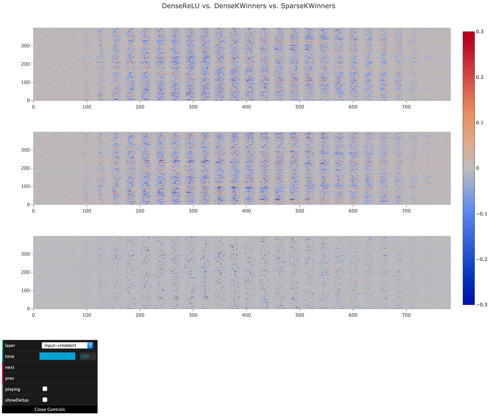

# Cerebro 3

A web-based visualization platform for Neural Networks.

## Example

## Backend

[Backend for Pytorch to save model states](backend/pytorch/README.md)

## Frontend

[JavaScript frontend to visualize model states](frontend/README.md)
